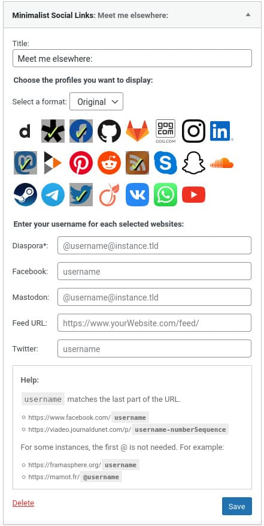
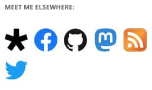

# Minimalist Social Links

 

A WordPress widget to display links to your social media profiles (among others).

## Introduction

It already exists plugins to display links to social media. However, many of them do not respect the brand guidelines. Logos are not up to date. The spacings rules are not respected. Logos are distorted. And so on.

I'm not saying that this project respects them totally. It's difficult to keep an harmony between the links while the logos have different shapes and spacing rules. But I'm trying to respect these rules. And if you have any ideas for improving the project while respecting the brand rules, I'm all ears.

I'm probably foolish when the brands themselves don't bother to play by their rules. For example, if you look the Instagram brand guidelines, all other logos are old. Yes, I refer to the Facebook logo for example. Same corporation and yet, the rules are not respected. Even so, I would like this project respect these rules.

## Install

### Composer installation

You can use Composer to install this plugin as a dependency if you use `wordpress-plugin` installers:

```
{
"require": {
    "armandphilippot/minimalist-social-links-widget": "dev-main"
}
"repositories": [{
    "type": "git",
    "url": "git@github.com:ArmandPhilippot/minimalist-social-links-widget.git"
}]
```

You can specify the version by adding the corresponding tag: `dev-main#v1.0.0`.

### Manual installation

You can download this plugin on Github, then extract it in `/wp-content/plugins/` directory.

## Usage

1. Navigate to the "_Plugins_" dashboard page and click on "_Activate_".
2. Add "_**Minimalist Social Links**_" to a widget area through the "_Widgets_" menu in WordPress.
3. Choose the links you want to display and fill your username.

## Screenshots



Examples:

| Twenty Nineteen Theme                                                  | Twenty Twelve Theme                                                  |
| ---------------------------------------------------------------------- | -------------------------------------------------------------------- |
|  |  |

## Disclaimer

I'm not using all these websites, so it is possible that some links are wrong. Feel free to post an issue if so.

Some logos are not officially available in SVG format (or they are well hidden) so there may be some differences.

If you want to overwrite the sizes of the links on pubic view, remember tu specify a rule for `pointer: fine` media query. The sizes are not the same on touch screens and devices using a mouse.

## License

This project is open source and available under the [GPL v2 or later License](https://github.com/ArmandPhilippot/minimalist-social-links-widget/blob/main/LICENSE).
