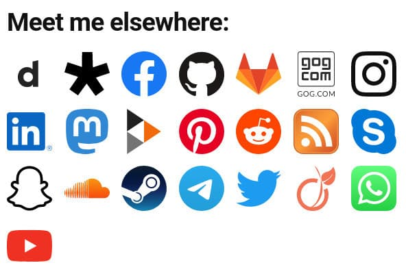
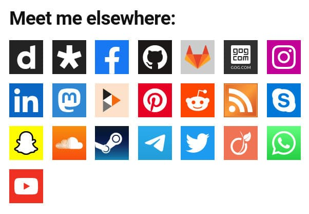

# Minimalist Social Links

 

A WordPress widget to display links to your social media profiles (among others).

## Introduction

This widget allows you to display links to your social profiles and RSS feed. The links are displayed as clickable logos.

Two logo formats are proposed:

-   `Original`: the original logos that try to respect the branding guidelines.
-   `Square`: the logos transformed into a square format.

The `Original` format works fine on light themes. However, on dark themes, some logos are hardly visible (Github or Diaspora\* for example). As the widget cannot guess your theme or your mechanism for changing themes, it is difficult to (dynamically) come up with an alternative logo.

The `Square` format works fine on both themes. The background for some logos are still dark, but the logos are readable.

## Install

### Composer installation

You can use Composer to install this plugin as a dependency if you use `wordpress-plugin` installers:

```
{
"require": {
    "armandphilippot/minimalist-social-links-widget": "dev-main"
}
"repositories": [{
    "type": "git",
    "url": "git@github.com:ArmandPhilippot/minimalist-social-links-widget.git"
}]
```

You can specify the version by adding the corresponding tag: `dev-main#v1.0.0`.

### Manual installation

You can download this plugin on Github, then extract it in `/wp-content/plugins/` directory.

## Usage

1. Navigate to the "_Plugins_" dashboard page and click on "_Activate_".
2. Add "_**Minimalist Social Links**_" to a widget area through the "_Widgets_" menu in WordPress.
3. Choose the links you want to display and fill your username.

## Screenshots


Examples:

| Original Format                                            | Square Format                                          |
| ---------------------------------------------------------- | ------------------------------------------------------ |
|  |  |

## Disclaimer

I'm not using all these websites, so it is possible that some links are wrong. Feel free to post an issue if so.

Some logos are not officially available in SVG format (or they are well hidden) so there may be some differences.

The size is not modifiable in the widget admin. But, you can change it in your theme by overriding the default `.mslwidget__logo` width and height.

**Note:** The widget uses a media query `pointer: fine` to display a different size if it is a touch screen or a screen with a pointer device.

## License

This project is open source and available under the [GPL v2 or later License](https://github.com/ArmandPhilippot/minimalist-social-links-widget/blob/main/LICENSE).
